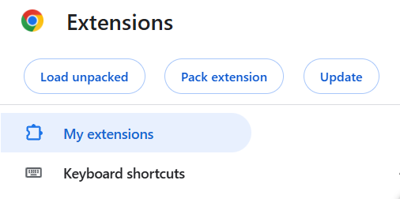
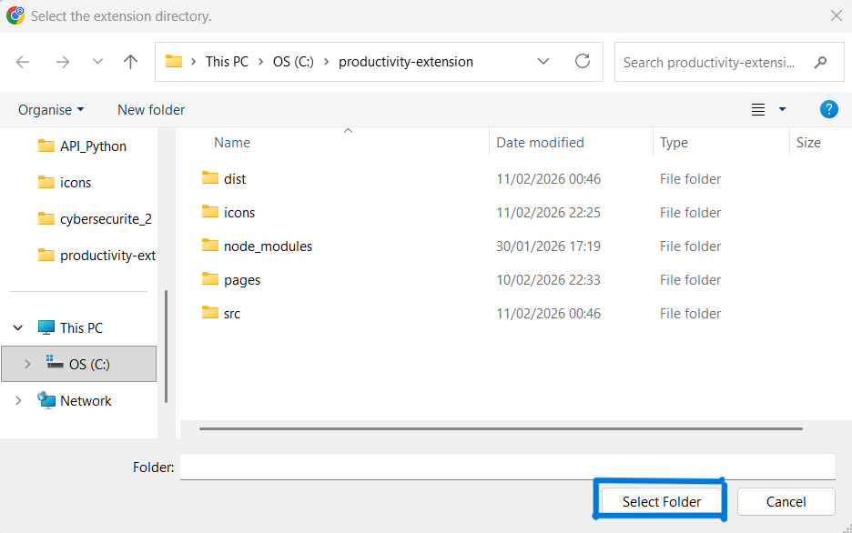
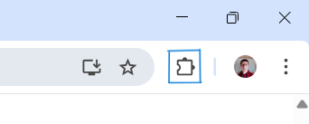

# Productivity Extension

[](https://github.com/hugo-jaumotte/Productivity-extension)
[](https://github.com/hugo-jaumotte/Productivity-extension/blob/main/LICENSE)  <!-- Change to your license -->
[](https://developer.chrome.com/docs/extensions/develop/migrate/what-is-mv3)

<p align="center">
  
</p>

A Chrome extension to help you stay focused by **blocking distracting websites**, including YouTube Shorts, sidebars, and social media feeds.

---

## Features

- Toggle blocking for:
  - YouTube Shorts
  - YouTube sidebar recommendations
  - Selected websites (custom blocklist)
- Add or remove sites from your blocklist easily
- Light and dark theme support
- Quick access links to settings and external resources

---

## Screenshots

<table align="center">
  <tr>
    <td align="center">
      <br/>
      <sub><b>Popup – Light theme</b></sub>
    </td>
    <td align="center">
      <br/>
      <sub><b>Blocklist Management - Dark theme</b></sub>
    </td>
  </tr>
</table>
<table>
  <p align="center">
    <br>
    <sub><b>Blocked site screen</b></sub>
  </p>
</table>

---

## Installation

1. Open a terminal and clone the repository on your computer:
   ```bash
   git clone https://github.com/hugo-jaumotte/Productivity-extension.git

2. Open Chrome extension manager:
   ```bash
   chrome://extensions/

3. Enable the Developer mode:
  <p align="center">
    
  </p>

4. Click on "Load Unpacked"
  <p align="center">
    
  </p>

5. Select the extension folder and open it:
  <p align="center">
    
  </p>

6. Click here to access your extensions:
<p align="center">
    
  </p>

---

## Technologies and Architecture

### Programming Language
- TypeScript

### Extension Platform
- Chrome Extension API (Manifest V3)

### Network Filtering
- DeclarativeNetRequest API

### Content Manipulation
- Content Scripts (DOM API)

### State Management
- Chrome Storage API

### Frontend
- HTML
- CSS

---

## Technical Decisions

### Chrome Extension Architecture (Manifest V3)

1. Issue
Needed a modern, supported architecture for Chrome that allows the extension to request all the permissions required for its proper functioning.

2. Solution
The manifest.json file defines the functionality of the extension and the permissions required for its proper functioning.
Manifest V3 is the latest version, more efficient, and compliant with the current Chrome browser policies. Its declarative permissions model ensures the extension requests only what it needs, improving security.


### Preemptive Network Blocking

1. Issue
We need an effective way to block websites that are part of the user’s blocked list.

2. Solution
When a webpage is requested, the browser sends an HTTP/HTTPS network request to the server. Preemptive network blocking intercepts the request and stops it before the page loads, preventing the website from appearing at all.
The most effective approach in Chrome is using the declarativeNetRequest API, which lets us define rules for automatically blocking requests.

### Content Scripts & DOM Manipulation

1. Issue
Some distracting content, like YouTube Shorts or sidebar recommendations, cannot be blocked purely at the network level since they appear in the DOM.

2. Solution
Content scripts are JavaScript files that are injected into a webpage. They can access and manipulate the page’s DOM, allowing the extension to hide, remove, or modify specific elements after the page loads.

### State Management (Chrome Storage)

1. Issue
The extension needs to remember user settings, such as the blocklist or whether focus mode is enabled, even after the browser is closed or restarted.

2. Solution
Use the Chrome storage API to save settings locally. This allows the extension to persist user preferences across sessions and devices.