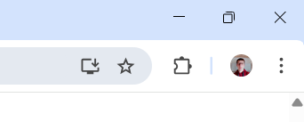

# Productivity Extension

<p align="center">
  
</p>

A Chrome extension to help you stay focused by **blocking distracting websites**, including YouTube Shorts, sidebars, and social media feeds.

---

## Features

- Toggle blocking for:
  - YouTube Shorts
  - YouTube sidebar recommendations
  - Selected websites (custom blocklist)
- Add or remove sites from your blocklist easily
- Light and dark theme support
- Quick access links to settings and external resources

---

## Screenshots

<table align="center">
  <tr>
    <td align="center">
      <br/>
      <sub><b>Popup – Light theme</b></sub>
    </td>
    <td align="center">
      <br/>
      <sub><b>Blocklist Management - Dark theme</b></sub>
    </td>
  </tr>
</table>
<table>
  <p align="center">
    <br>
    <sub><b>Blocked site screen</b></sub>
  </p>
</table>

---

## Installation

1. Open a terminal and paste this:
   ```bash
   cd C:\
   git clone https://github.com/hugo-jaumotte/Productivity-extension.git

2. Open Chrome extension manager:
   ```bash
   chrome://extensions/

3. Enable the Developer mode:
  <p align="center">
    
  </p>

4. Click on "Load Unpacked"
  <p>
    
  </p>

5. Select the extension folder and open it:
  <p>
    
  </p>

6. Click here to acces to your extensions:
<p>
    
  </p>